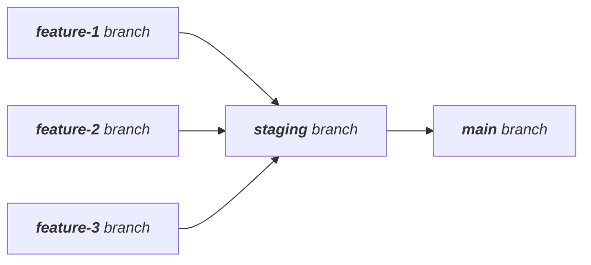

# Workflow git

Ces notes ont pour but d'établir le workflow git que nous utiliserons pour ce projet. Ce workflow est principalement inspiré des deux articles suivants :

* [git essentials](https://www.robinwieruch.de/git-essential-commands/)
* [git team workflow](https://www.robinwieruch.de/git-team-workflow/)




## Principes de bases

### La branche *main*

**`git`** est un système de versionnage qui permet de traquer l'état d'un projet dans le temps. Chaque projet possède au moins une branche : la branche **`main`**. La branche main permet de traquer les différentes versions d'un projet. *Une version d'un projet est simplement un état du projet où l'ensemble des tests unitaires, fonctionnels et d'intégrations critiques sont passées avec succès.* 

**Remarque : sauf lors de la configuration initiale du projet `git`, on ne travail pas directement sur cette branche.**

### La branche *staging*

Nous introduisons une seconde branche : la branche **`staging`** (*staging branch*). Cette branche  est une branche d'intégration et de validation. C'est une branche d'intégration car elle nous sert à agréger tous les commits issus des `branches feature` – *branches créées pour le développement de nouvelles fonctionnalités (features)*. C'est aussi une branche de validation car nous éxécutons notre batterie de tests lors notre première étape de notre cycle `CI/CD`. Si tous les test sont passés avec succès alors cette branche sera mergée sur la branche `main`.  La branche `main` doit recevoir uniquement les commits de la branche `staging`.

**Remarque : tout comme pour la branche *main*, on ne travail pas directement sur cette branche.** 
<p align='center'>
	
</p>


### Les branches features

Les branches `features` sont des branches créées à partir de la branche `staging`. Elles ont pour rôle des développer de nouvelles fonctionnalités. Avant d'être mergée sur la branche `staging`les test unitaires et fonctionnels doivent être passée avec succès.

## CI/CD

Nous utiliserons github actions pour automatiser le déploiement de l'application. Dans les grandes ligne les étapes sont :

1. Créer une branche **`feature-*`** à partir de la branche **`staging`**.

2. Développer et implementer les features et leur tests associé locallement.

3. Création d'une _Pull Request_ (PR) pour merger la branche **`feature-*`** dans la branche **`staging`**.

   1. _GitHub Actions_ déclenche les vérifications CI de la PR (linting, tests unitaires, ...)?
   2. Code review. 
   3. Après acceptation, la branche **`feature-*`** est mergée dans la branche **`staging`**.

4. La pipeline CI/CD est exécutée automatiquement sur la branche **`staging`**.

   1. Si tout les tests sont passés avec succès, une PR  est créée pour merger la branche **`staging`** sur la branche **`main`**.
   2. Après vérification, le merge est effectué.

5. Le déploiement en production se déroule automatiquement.

## Commandes git

Dans cette section nous donnons la liste des commandes `git` principales à utiliser. Cette liste est non-exhaustive et sera mise à jour en temps voulus.

### git status

Cette commande vous donne le statut du projet git, c'est à dire le nom de la branche sur laquelle on se trouve ainsi que la liste des fichiers modifiés – traqués ou non.
```bash
git status
```


### git checkout

Cette commande permet de se placer sur une branche en particulier.

```bash
git checkout [-b] <branch>
```

Si nous souhaitons créer une nouvelle branche nous pouvons utiliser l'option `-b`. Dans ce cas, _git_ créera une nouvelle branche et nous placera sur celle-ci. 

**Remarque : lorsque l'on créer une nouvelle branche, on le fait à partir d'une branche existante. Il faut donc vérifier sur quelle branche on se trouve. **   

### git fetch 

Cette commande synchronise la liste des branches du répertoire local avec le répertoire distant  

```bash
git fetch
```

### git pull

Pour effectuer une mise à jour du contenu des branches entre le répertoire distant et le répertoire local nous utilisons cette commande.

```bash
git pull origin <branch>
```

Cette commande va synchroniser le contenu local de la branche sélectionnée du répertoire distant en mettant en priorité les changements présent sur le répertoire distant. Pour mettre la priorité sur les modifications locales on peut utliser la commande suivant :

```bash
git pull --rebase origin <branch>
```

### git branch

Cette commande permet de manipuler les branches git.

```bash
git branch [-a] [-d <branch>] 
```

L'option `-a` permet de lister toutes les branches disponibles localement. L'option `-d <branch>` permet de supprimer une branche localement.

### git add

Indexe un fichier ou un ensemble de fichiers pour les inclure dans le prochain commit.

```bash
git add <file1> [file2] [file2] [...]
```

**Remarque : on peut directement indexer un dossier en donnant directement le nom d'un dossier**.

Il arrive par erreur que nous ayons indexé un fichier par erreur. Dans ce cas tant que nous n'avons pas fait un commit nous pouvons désindexé un fichier en utilisant:

```bash
git reset --HEAD <file>
```

### git commit

Fige l'état d'une branche et inscrit ce dernier dans l'arbre des commits _git_.

```bash
git commit -m '<message>'
```

**Remarque : on doit toujours mettre un message pour un commit afin de pouvoir facilement les identifier si besoin dans l'arbre des commits. Les message suit une convention particulière décrite plus bas.**

### git push

Met à jour le répertoire distant.

```bash
git push origin <branch>  
```

Pour supprimer une branche sur le répertoire distant, après l'avoir supprimée localement la syntaxe change :
```bash
git push origin :<branch>
```

## Workflow git complet

Cette section montre l'ensemble des commandes à réaliser.

```bash
# check tatus
git status

# go to staging branch
git checkout staging

# create new feature branche
git checkout -b <feature-branch>

# feature dev ...
# stage modified files
git add feature.py
# commit changes
git commit -m 'fixing parsing function'

# perform required tests...

# push to remote
git push origin <feature-branch>

# Then go to GitHub to open a new pull request
# After merge if not already done
git checkout staging
git branch -d <feature-branch>
git push origin :<feature-branch>
```

